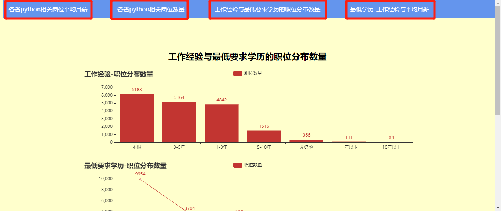

# <svg t="1578230313391" class="icon" viewBox="0 0 1024 1024" version="1.1" xmlns="http://www.w3.org/2000/svg" p-id="2004" width="200" height="200"><path d="M773.02528 781.265455a23.738182 23.738182 0 0 1-24.273455 5.72509l-301.963636-100.398545a23.645091 23.645091 0 0 1-15.010909-29.928727 23.738182 23.738182 0 0 1 30.021818-14.987637l256.954182 85.434182-85.620364-256.395636a23.714909 23.714909 0 1 1 45.009455-14.987637l100.608 301.312c2.839273 8.517818 0.628364 17.896727-5.725091 24.22691" fill="#546A79" p-id="2005"></path><path d="M616.260189 624.965818c-114.967273 114.990545-339.106909 85.085091-489.448727-65.256727C-12.708538 420.189091-26.741993 223.790545 94.159825 102.865455 215.084916-18.036364 411.483462-4.002909 551.003462 135.517091c150.341818 150.341818 180.247273 374.481455 65.256727 489.448727zM159.439825 168.145455c-85.085091 85.085091-71.377455 222.301091 32.628364 326.306909 111.010909 111.010909 282.088727 142.103273 358.935273 65.256727 76.846545-76.846545 45.754182-247.924364-65.256727-358.935273C381.740916 96.768 244.524916 83.060364 159.439825 168.145455z" fill="#EEAF4B" p-id="2006"></path><path d="M977.895098 986.600727c-26.554182 26.554182-55.249455 40.913455-64.093091 32.069818l-224.372363-224.372363c-8.866909-8.866909 5.492364-37.562182 32.046545-64.116364 26.554182-26.554182 55.249455-40.913455 64.093091-32.046545l224.395636 224.372363c8.843636 8.843636-5.515636 37.538909-32.069818 64.093091" fill="#88C057" p-id="2007"></path></svg><marquee>Python_Data</marquee>

---

一个用python flask搭建的web，进行数据交互可视化，主题为<strong>python岗位相关分析</strong>并部署在[PythonAnywhere👈](http://Elaine.pythonanywhere.com/)进行展示。

同时此项目为中山大学南方学院17-18级网络与新媒体python课程期末作业，三人协作完成，搭档[camaxjj](https://github.com/camaxjj/python)&[Huhu-Estelle](https://github.com/Huhu-Estelle/)

---

## 👍HTML档描述
##### 分为四个页面展示python岗位分析内容

1. [各省python相关岗位平均月薪](http://elaine.pythonanywhere.com/)以地图方式呈现，得出结论Python这个关键词下，全国16946条样本的月薪平均值为14197元/月。
2. [各省python相关岗位数量](http://elaine.pythonanywhere.com/effectscatter_symbol)以热力图方式呈现，得出结论结论：北上广浙这四个省份占据了超过60%以上的职位数。
3. [工作经验与最低要求学历的职位分布数量](http://elaine.pythonanywhere.com/pie_base)以柱状图和折线图方式呈现，得出结论上半部分的柱状图可以看出工作经验要求【不限】的数量最多，达6183个岗位，因此可以初步推断Python相关岗位，只要你技术过硬能够胜任工作，并没有工作经验方面的硬性要求。
4. [最低学历-工作经验与平均月薪](http://elaine.pythonanywhere.com/bar)以折线图方式呈现，得出结论如图所示，我们可以看出无论是从同一学历不同经验还是相同经验不同学历条形图都是呈增长趋势的，因此可以判断出Python相关岗位的月薪是与学历经验直接相关的。以后想从事这个行业的同学，需要多多实操，好好学习，平均月薪的多少与你技术能力的不可替代性息息相关。
<strong>人生苦短，我用PYTHON</strong>
* (在templates文件下的base.html中以.top写出导航栏，以<a>标签链接其它页面实现选项跳转，并以css和style定义导航栏的样式)
* 在.html页面以<link href="../static/hf.css" rel="stylesheet"/>链接到static中的hf.css样式.
* 在body里以<aside style>写入一个文本方框及内容。
### 👌Python档描述

- 主运行文件为 `app.py ` 文件。

- `static ` 为网页样式。
 
-  `templates ` 里的`map.html`系列文件为生成可视化图表的离线文件，作为引用文件。
 
-  `data1.csv ` 等csv文件为引用的数据文档。

-  `all.xls ` 为总的数据源。

* 在flask环境下导入pandas、pyecharts实现数据图表交互展示。
* 写出四个@route，分别呈现为<strong>各省python相关岗位平均月薪、各省python相关岗位数量、工作经验与最低要求学历的职位分布数量、最低学历-工作经验与平  均月薪</strong>的相关图表展示。
* df = pd.read_csv('xxx.csv',encoding = 'utf8', index_col="xxx")英文采用单字节编码，部分中文采用双字节编码。
* 利用.renter/with open导入和打开文件。
* 调用pyecharts模块作图传输到HTML页面。
* 使用list字典循环。

## 📗Web_App动作描述
##### 🔑一
用户点击导航栏四个选项，跳转到想了解的页面
[平均月薪](http://elaine.pythonanywhere.com/)
[岗位数量](http://elaine.pythonanywhere.com/effectscatter_symbol)
[工作经验](http://elaine.pythonanywhere.com/pie_base)
[最低学历](http://elaine.pythonanywhere.com/bar)

##### 🔐二
用户通过选择器点击想要了解的城市，可显示该城市的相关岗位数量

##### 🔐三
鼠标下拉可看文字结论分析

## 📝数据交互\自定义函数模块描述

代码
[详细app.py👈](https://github.com/ElaineToto/Python_Data/blob/master/app.py)）

### 🐂HTML页面交互及Jinja2

### [🔗我PythonAnywhere](http://Elaine.pythonanywhere.com/)

### [🔗搭档PythonAnywhere](http://xjiajian.pythonanywhere.com/)

### [📦代码仓库](https://github.com/ElaineToto/Python_Data)
